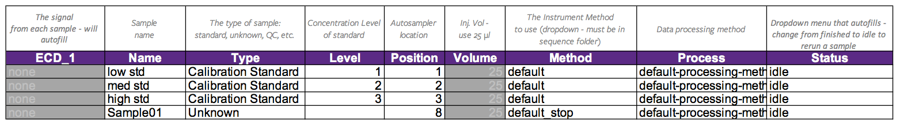

---
output:
  html_document: 
    number_sections: yes
    theme: simplex
  pdf_document:
    number_sections: yes
---

# Thermo-Dionex ICS-1600 Ion Chromatograph {-}

AF | 2018-09-17

> *If you encounter problems while running the instrument, please use submit an [**Instrument Incident Report**](https://docs.google.com/forms/d/e/1FAIpQLSc96MiK73kKP06KEZpR0-O7zETCLvWgQtLp_bKEynosUKqpNg/viewform) with a description of your problem.  **For urgent problems please report to Al Fischer, NS 209, dfischer@wcu.edu, x2695!***

# Login
1. If you have not done so already, open the web browser to check the instrument calendar and make sure there are no scheduling conflicts; reserve/log your time with the online form.
1. Login to the computer using `.\labuser` as the username and `labuser` as the password.
1. Connect to the `NEON` server by going to **My Computer** and clicking on the `NEON` drive; login using the username `labuser` and the password `qwerty` if necessary.  *If the computer is not connected to `NEON` the software will not work.*
1. Open the **Chromeleon** software and instrument usage log by clicking the shortcut on the desktop.

# Prep the Instrument
1. Check to see that there is enough eluent for your run in the bottle on top of the IC. *Do not run if there is not enough eluent!*
1. Open the front cover of the IC and open the waste valve (black knob on the left pump head).  This allows eluent to flow directly to waste and helps keep bubbles out of the system.
1. Navigate to the **Instruments** pane (left side of window) and the **Pump_ECD** tab, and then click **Prime**.
1. Make sure you've opened the waste valve and click **OK**, then Let the system purge for at least two minutes.
1. Click **Off** to turn off the pump.
1. Close the waste valve (make sure you turn off the pump first!).
1. Turn the pump back on by clicking **On**; ensure the flow is 1.2 mL/min.
1. After 2 minutes have elapsed, you may turn on the suppressor.  Activate the slider switch next to suppressor, and check on the IC front panel that the current is 31 mA.  *Sometimes there is a delay before the suppressor comes on*.
1. Make sure the suppressor is working by looking for bubbles leaving the suppressor unit.
1. Close the front panel and allow the instrument to warm up to a stable baseline.

# Prepare a Sequence
*You may prepare your sample sequence while the instrument is warming up.*

1. Select the ICS1600 in the left pane of the software.
1. Navigate to your folder either click on your sequence or copy and paste the default sequence into your folder so that you can edit it.
1. Edit the sequence as necessary. Use the table below as a guide; do not change the injection volume.
1. *If you plan to run the autosampler unattended, the last sample should use a version of your method that includes a stop function so the eluent does not get pumped dry!*
1. When your sequence is ready you may click **Start Sequence**.

# Analyze

1. Double click on one of your chromatograms in the **ECD_1** column to open it in the data processing software.
1. Select the **Data Processing** pane at the bottom left of the screen.
1. Enter the actual concentration of each analyte in your standards in the processing method window.
1. You may explore the data in the various windows on the screen.

# Save/Export

1. Select the **Report Manager** pane at the bottom of the screen.
1. Click through the various tabs at the bottom of the window, and select the one you wish to export (the software will only export the current tab).
1. Click on the **Chromeleon** symbol at the top left of the screen and select **Export**.
1. Choose a destination and file type.  Remember to place your data on `NEON` for access later.

# Shutdown
1. Turn off the suppressor by activating the slider until it reads "Off" (if it is not off already).
1. Turn off the pump by clicking the pump **Off** button (if it is not off already).
1. Close the software.
1. Log off of Windows.
